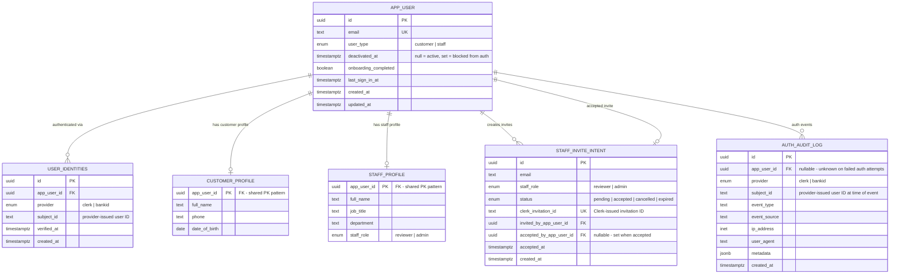

# ER Diagram — Auth and User Tables

## Overview

- `APP_USER` - identity anchor. One row per person regardless of auth provider. AuthGuard reads this table only.
- `USER_IDENTITIES` - one row per provider per user. Clerk for staff, BankId for customers. Decouples the user record from any specific auth system.
- `CUSTOMER_PROFILE` - customer domain data. Created after onboarding is complete.
- `STAFF_PROFILE` - staff domain data. Created when a staff member is provisioned.
- `STAFF_INVITE_INTENT` - tracks the lifecycle of a staff invitation from creation to acceptance.
- `AUTH_AUDIT_LOG` - immutable record of every auth event. Never updated, only appended.

`APP_USER` is always created first. Profile rows are created separately. Auth never depends on a profile existing.

---

## Diagram



---

## Relationships

| Relationship                    | Cardinality        | Notes                                                                                                                                                                                                                                     |
| ------------------------------- | ------------------ | ----------------------------------------------------------------------------------------------------------------------------------------------------------------------------------------------------------------------------------------- |
| APP_USER -> USER_IDENTITIES     | one-to-many        | MVP: all users authenticate via Clerk. Customers can later migrate to BankId by adding a new identity row - APP_USER untouched. Staff remain Clerk only. Unique constraint is on (provider, subject_id) composite - not subject_id alone. |
| APP_USER -> CUSTOMER_PROFILE    | one-to-zero-or-one | Only exists when user_type = customer and onboarding_completed = true                                                                                                                                                                     |
| APP_USER -> STAFF_PROFILE       | one-to-zero-or-one | Only exists when user_type = staff and provisioning is complete                                                                                                                                                                           |
| APP_USER -> STAFF_INVITE_INTENT | one-to-many        | A staff member can invite multiple people over time                                                                                                                                                                                       |
| APP_USER -> AUTH_AUDIT_LOG      | one-to-many        | Every login, failure, and token event is appended here                                                                                                                                                                                    |

---

## Why USER_IDENTITIES is a separate table

`APP_USER` originally held `clerk_user_id` directly. That works when Clerk is the only provider, but breaks the moment a second provider (BankId) is added, because you cannot put two different identities into one column.

The `USER_IDENTITIES` table stores `(provider, subject_id)` pairs. The `ResolveUserUseCase` receives a `VerifiedIdentity { provider, subjectId }` from whichever adapter verified the token, then looks up the matching identity row to find the `APP_USER`. Adding BankId support later means adding a `BankIdAdapter` - the use case and `APP_USER` table stay unchanged.

```
Request with Clerk JWT
  -> ClerkAdapter.verify()  -> VerifiedIdentity { provider: 'clerk', subjectId: 'user_xxx' }
  -> ResolveUserUseCase     -> lookup USER_IDENTITIES where provider='clerk' and subject_id='user_xxx'
  -> returns APP_USER

Future: Request with BankId token
  -> BankIdAdapter.verify() -> VerifiedIdentity { provider: 'bankid', subjectId: '<pid>' }
  -> ResolveUserUseCase     -> lookup USER_IDENTITIES where provider='bankid' and subject_id='<pid>'
  -> returns APP_USER        (same use case, no changes)
```

---

## DDD mapping

| Table                 | DDD concept                | Module             |
| --------------------- | -------------------------- | ------------------ |
| `APP_USER`            | Identity aggregate root    | `auth` module      |
| `USER_IDENTITIES`     | Child entity of APP_USER   | `auth` module      |
| `CUSTOMER_PROFILE`    | Customer aggregate root    | `customers` module |
| `STAFF_PROFILE`       | StaffMember aggregate root | `staff` module     |
| `STAFF_INVITE_INTENT` | Invite aggregate           | `staff` module     |
| `AUTH_AUDIT_LOG`      | Append-only audit record   | `auth` module      |

The `auth` module owns `APP_USER`, `USER_IDENTITIES`, and `AUTH_AUDIT_LOG`. It never reads `CUSTOMER_PROFILE` or `STAFF_PROFILE`. Those modules load their own aggregates via their own repositories after auth resolves the `APP_USER`.
